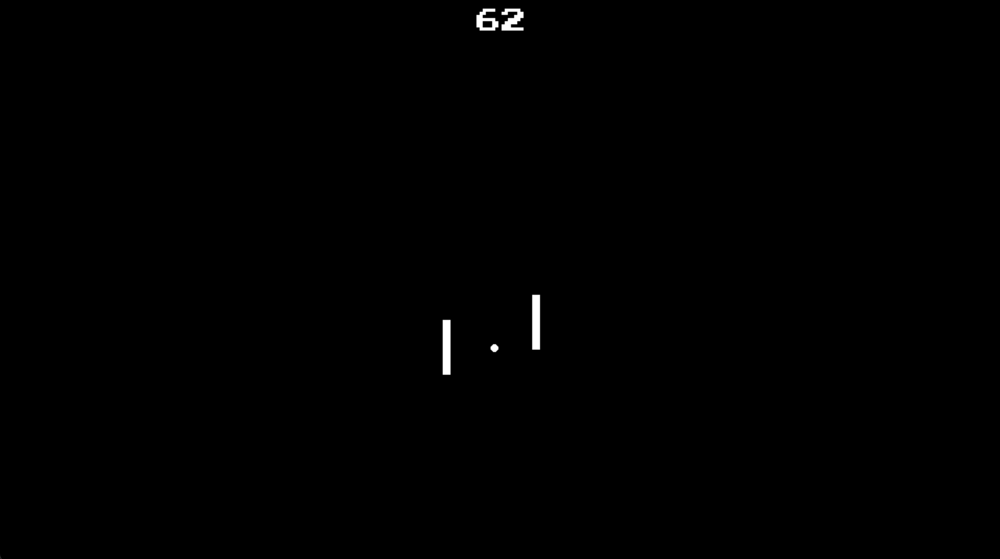

# Song Pong

[https://www.youtube.com/watch?v=V0AXprDRsUU](https://www.youtube.com/watch?v=lxjElOAgkPg)



This is a version of Pong that synchronizes the bounces with a song. You are free to use this code for any purpose, I only ask that you link back to this repo.

## Basic Usage

1. Install the required dependencies:

   ```
   pip install pygame numpy cvxpy mido
   ```

   Alternatively, you can use `uv` to install the dependencies:

   ```
   pip install uv
   ```

2. Run the game with a MIDI file:

   ```
   curl -o example_midi.mid https://bitmidi.com/uploads/72257.mid # download a MIDI file
   python pong.py example_midi.mid
   ```

   Or using `uv run`:

   ```
   uv run pong.py example_midi.mid
   ```

3. For non-MIDI audio files, you need to provide a JSON file with note timings:

   ```
   python pong.py path/to/your/audio_file.mp3 --times_file path/to/your/times.json
   ```

   Or using `uv run`:

   ```
   uv run pong.py path/to/your/audio_file.mp3 --times_file path/to/your/times.json
   ```

   The JSON file should contain a list of times (in seconds) when the ball should hit a paddle.
